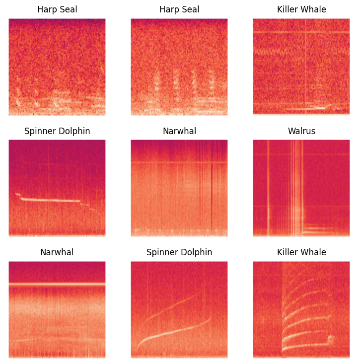

<!-- PROJECT LOGO -->
<br />
<div align="center">
  <h3 align="center">Under the Sea - Deep Learning for Marine Mammal Sound Classification</h3>

  <p align="center">
    <br />
    <a href="https://watkins-marine-sound.streamlit.app/">View Demo</a>
    ·
    <a href="https://github.com/aliceheiman/watkins-marine-sound-model/issues/new?labels=bug&template=bug-report---.md">Report Bug</a>
    ·
    <a href="https://github.com/aliceheiman/watkins-marine-sound-model/issues/new?labels=enhancement&template=feature-request---.md">Request Feature</a>
  </p>
</div>

<!-- ABOUT THE PROJECT -->
## About The Project

In this project, I use Deep Learning (DL) to develop a model capable of classifying marine animals based on audio recordings.

Streamlit Demo: [https://watkins-marine-sound.streamlit.app/](https://watkins-marine-sound.streamlit.app/).

<p align="center">
  
</p>

## Installation

```shell
git clone https://github.com/aliceheiman/watkins-marine-sound-model.git
```

Then, run the Streamlit demo locally using

```shell
pip install -r requirements.txt
streamlit run app.py
```

## Usage

Navigate to the project folder, then start the streamlit demo using

```shell
streamlit run app.py
```

The instructions on how to classify images are found on the demo!

## License

Distributed under the Unlicense License. See `LICENSE.txt` for more information.

## Contact

Alice Heiman - aheiman@stanford.edu

Project Link: [https://github.com/aliceheiman/watkins-marine-sound-model](https://github.com/aliceheiman/watkins-marine-sound-model)

<p align="right">(<a href="#readme-top">back to top</a>)</p>
